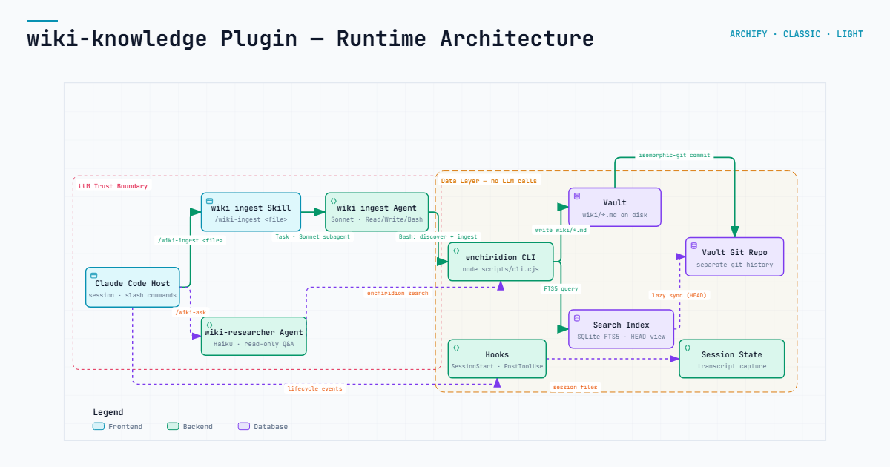

# wiki-knowledge

Personal knowledge management powered by LLM agents. Turns raw documents into a structured, searchable, git-backed markdown wiki vault — then answers questions over it with typed-edge graph traversal and cited synthesis.

Follows the [Karpathy LLM-wiki pattern](https://gist.github.com/karpathy/442a6bf555914893e9891c11519de94f).

## What's inside

- **wiki-knowledge** — a Claude Code / OpenCode plugin that provides ingestion and retrieval over a markdown wiki vault
- **Agent pipeline** — Claude Sonnet for semantic ingestion (chunking, overlap classification, edge typing); Claude Haiku for retrieval (query expansion, BM25 search, frontier traversal, synthesis) - models are configurable for OpenCode
- **Deterministic script layer** — a single TypeScript bundle for vault I/O, placement, FTS5 search indexing, and commit construction (no model calls, no runtime to install — it runs on the already-installed Node)
- **Full-text search** — SQLite FTS5 via stdlib, zero extra search dependencies

## Install

### Claude Code

1. Add the marketplace entry and install the plugin:
   ```
   /plugin marketplace add dhague/wiki-knowledge
   /plugin install wiki-knowledge
   ```

2. Create a vault — either:
   - **Local**: `/wiki-init .` inside a project to keep the vault alongside your codebase.
   - **Remote**: `/wiki-init /some/remote/path` then set `WIKI_ROOT` to query it from anywhere. Useful when a wiki spans multiple projects or lives on a shared drive.

### OpenCode

```bash
npx @dhague/wiki-knowledge
```

Deploys the plugin into the vault's `.opencode/` directory. Pass `--global` to install into `~/.config/opencode/` for query-from-anywhere mode.

### Joule Work Desktop

Install individual skills into Joule Work Desktop via the AI Skills Library:

Download the per-skill ZIP files from the [latest GitHub Release](https://github.com/dhague/wiki-knowledge/releases/latest) (`wiki-ingest.zip`, `wiki-ask.zip`) and install each via Joule Desktop's "Install from file" option (Extensions > Add Skill > Upload).

### Standalone CLI

The script layer ships as a TypeScript bundle invoked through
`wiki-plugin/bin/enchiridion` (a thin shim that execs `node` against it).

## Design principles

**Cost-optimised by design.** Ingestion and retrieval run as subagents with model selection tuned to task. Sonnet handles the expensive judgment work (semantic chunking, edge typing); Haiku handles high-volume retrieval at a fraction of the cost. Each query only explores the frontier it needs — no expensive vector re-ranking, no full-graph traversal.

**Predictability through scripts, not prompts.** Everything that can be deterministic *is*. Page placement, frontmatter parsing, link rewriting, search indexing, and commit construction run as subcommands of a single CLI (`bin/enchiridion` — a TypeScript bundle run on Node) — no model in the loop. The agents call it for side effects and read its output; they never generate file paths, YAML, or git operations from a prompt.

**No new infrastructure.** SQLite FTS5 search runs in-process with zero extra dependencies. No additional runtime to install — the script layer runs on the already-installed Node interpreter. No vector database, no MCP server, no background daemons. The vault is just a git repo of markdown files — portable, diffable, and backup-friendly.

**Trust and provenance.** Every derived page traces back to its raw source through a chain of evidence. Bitemporal metadata (when the knowledge is *from* vs. when it was *written*) and explicit volatility annotations make staleness visible, not hidden.

**Agent-native, not API-native.** Ingestion and retrieval are skills that Claude Code agents execute by reading instructions and running scripts. This means the full context window, tool use, and reasoning of frontier models are available — not limited by a fixed RAG pipeline or a hardcoded prompt template.

## Commands

| Command | Purpose |
|---|---|
| `/wiki-init [path]` | Scaffold a new vault (folders, git repo, index) |
| `/wiki-ingest <path>` | Ingest one file, a folder, or sweep `raw/` |
| `/wiki-watch` | Long-running auto-ingest watcher for `raw/` |
| `/wiki-ask <question>` | Grounded, cited answer from the vault |
| `/save-conversation` | Capture and ingest the current session |

## Vault structure

```
raw/           # Inbox — drop documents here for ingestion
wiki/
  concepts/    # Abstract ideas, frameworks, definitions
  entities/    # Concrete people, tools, projects, organizations
  sources/     # Provenance stubs (one per raw artifact)
  synthesis/   # Cross-cutting analysis and summaries
```

Every page has YAML frontmatter with a typed edge graph (`refines`, `contradicts`, `example-of`, `source`, `related`, `supersedes`) and bitemporal metadata (`source_date`, `volatility`).

## Development

The script layer is a single TypeScript implementation
([ADR-0017](docs/adr/0017-bundled-typescript-on-installed-interpreter.md)),
bundled by esbuild and invoked via `wiki-plugin/bin/enchiridion` — a thin shim
that execs `node` against the bundle. `ENCHIRIDION_BIN` points that entrypoint
at a local build or alternate runtime instead.

```bash
cd enchiridion-ts
npm ci
npm run typecheck && npm run lint && npm run format:check
npm run build   # esbuild bundle to dist/cli.cjs + wasm sidecar
npm test

# Run any subcommand against the built bundle
WIKI_ROOT=<path_to_vault> node dist/cli.cjs search "connection pooling" --limit 10
WIKI_ROOT=<path_to_vault> node dist/cli.cjs ingest-scan --json
```

`wiki-plugin/scripts/` holds only OpenCode install-time tooling
(`generate-opencode.py`, `install-opencode.py`) — see
[README-opencode.md](README-opencode.md). It has its own small test suite:

```bash
cd wiki-plugin
python3 -m venv .venv && source .venv/bin/activate
pip install ruamel.yaml pytest
python -m pytest
```

## Architecture



Key decisions are documented in [docs/adr/](docs/adr/):
- No MCP server — everything runs as skills + agents + Bash-invoked scripts
- No embeddings — lexical FTS5 search + agent comprehension
- Bitemporal data model (valid time + transaction time)
- Chain of evidence from every derived page back to its raw source

See [CONTEXT.md](CONTEXT.md) for the domain glossary.
